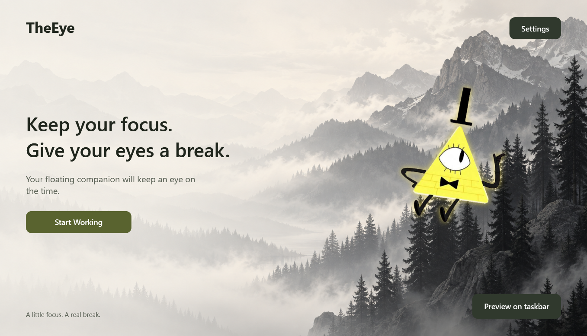
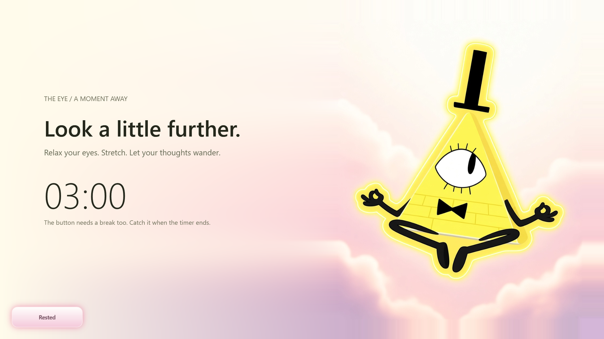

# TheEye

Native Windows 11 focus/rest timer with a floating triangle companion.
Double-click `artifacts/TheEye-win-x64/TheEye.exe`; no command or runtime
installation is needed. Keep the adjacent Assets and Pets folders together.
Right-click the running taskbar icon to pin it.




## Use

- Start Working begins a fresh 20-minute session with the companion hidden.
- At five minutes remaining it shows “5 min to rest” for six seconds, makes
  one slow left-and-right pass, then hides. The pass takes 36 seconds at
  default speed and respects the animation-speed slider.
- At one minute remaining it returns with a live 01:00 to 00:01 countdown;
  at zero the rest screen replaces it. It stays hidden between these reminders.
- Preview on taskbar, in Settings or the main window, runs the actual desktop
  animation for 25 seconds without changing the session.
- Resting Now minimizes the main window and opens the supplied meditation pose
  on an opaque ivory/pink cloud scene.
  An early break starts the same configured minimum rest lock as an automatic
  break (when strict mode is enabled); it cannot be completed early.
- At the work deadline, mandatory rest begins. For two minutes the visible
  Rested button dodges the pointer and rejects clicks, touch and keyboard input.
  The session state also rejects early completion. After the minimum, it settles
  and clicking it starts a fresh full session.
- Closing the main window hides it to the tray. Tray Exit intentionally quits.
  Single left-click the tray icon to reopen it; right-click opens its menu.
  Strict mandatory rest rejects ordinary close, Escape, Alt+F4 and tray Exit.
  It does not prevent termination through Task Manager.

Size, speed, animation, sounds and durations are configurable. Invalid numeric
input prevents saving. Work pauses during Windows lock/suspend; mandatory rest
reconciles on resume. Background applications are unaffected.

## Artwork and display

The two new supplied originals are preserved at native 912 x 1120 resolution.
The standing character is extracted with real alpha, preserving its white eye
and yellow aura while removing the white matte. No character asset is downsampled.
The main view layers this larger character over the native 1672 x 941 mountain
background. Rest uses a 2240 x 1260 landscape containing every original
meditation pixel unchanged, with the cloud background extended for the text.
Rest fills physical monitor bounds (including 1920 x 1080 at 125% Windows DPI).
Display scaling never changes the saved source images.

Buttons and the main window have matching golden glows. The outer glow uses
its own backing shape so image/text rendering stays sharp. Custom titlebar
controls support minimize, maximize/restore and hiding to the tray; drag the
titlebar to move the window, or double-click it to maximize/restore.
See [artwork provenance](artwork/README.md).

## Build, test and publish

Development requires .NET 10 SDK.

```powershell
dotnet build TheEye.sln -c Release
dotnet test TheEye.sln -c Release
dotnet run --project src/TheEye
powershell -File tools/publish.ps1
```

The publisher checks every manifest frame exists, matches its source hash,
meets its expected dimensions, and that the sprite has actual transparency.
Artwork regression checks: `python tools/test_triangle_assets.py` (Pillow and
NumPy required). Rebuild artwork with `python tools/compose_triangle.py`
(also requires OpenCV and SciPy). The supplied originals are never overwritten.

- `--dev-timers`: 30-second work and 10-second rest.
- `--preview`: immediate taskbar preview.
- `--verify-ui=<absolute-directory>`: exercise actual WPF windows, save captures
  and a results file. Checks Settings Save/Cancel, published assets, actual
  movement, rest minimization, locked-button rejection and unlocking. It saves
  the current settings unchanged.

## Architecture

- src/TheEye.Core: deadline-based session state machine, monotonic clock,
  settings and pet manifest models.
- src/TheEye: WPF UI, tray, monitor positioning, full-resolution image cache,
  click-through overlay and local persistence.
- tests/TheEye.Tests: deterministic timing, transition and settings tests.
- src/TheEye/Pets/Triangle: active pack. Named animations support optional
  sourceRect pixel bounds; asset paths cannot escape their package.

The session owns completion rules. One-second ticks update countdowns. WPF
animation clocks move the cached sprite and stop when hidden. The overlay does
not take focus or intercept taskbar clicks. No Explorer injection, drivers,
runtime network, accounts or telemetry.

Settings: `%LOCALAPPDATA%/TheEye/settings.json`.
Bounded error log: `%LOCALAPPDATA%/TheEye/theeye.log`.
Launch with Windows always starts idle.

## Limitations

Rest covers the monitor containing the cursor when it begins. Auto-hide and
nonstandard taskbars can leave a small gap. Strict mode is an application guard,
not a system lock. There is no installer/signing yet. Legacy dragon files remain
in the source tree but are excluded from the release.

## License

Application code is [MIT licensed](LICENSE). Supplied character artwork retains
its existing ownership and is not covered by the code license.
